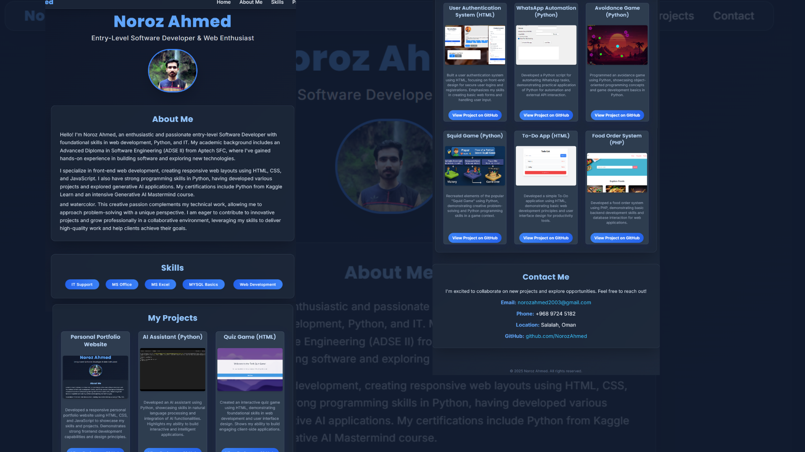

# Noroz Ahmed - Software Developer Portfolio



## 🌟 Overview

A modern, responsive personal portfolio website showcasing the skills, projects, and professional background of Noroz Ahmed, an entry-level Software Developer and Web Enthusiast. Built with HTML5, CSS3, and JavaScript, featuring a sleek dark theme with glassmorphism effects and smooth animations.

## ✨ Features

### 🎨 **Modern Design & UI/UX**
- **Dark Theme**: Elegant dark color scheme with blue accents
- **Glassmorphism Effects**: Modern glass-like cards with backdrop blur
- **Responsive Design**: Fully responsive across all devices (mobile, tablet, desktop)
- **Smooth Animations**: Hover effects, transitions, and interactive elements
- **Custom Scrollbar**: Styled scrollbar for enhanced visual appeal

### 🧭 **Navigation & Structure**
- **Sticky Navigation**: Fixed navigation bar with glassmorphism effect
- **Mobile Menu**: Hamburger menu for mobile devices with smooth transitions
- **Smooth Scrolling**: Seamless navigation between sections
- **Section Organization**: Well-structured content sections (Home, About, Skills, Projects, Contact)

### 🎯 **Interactive Elements**
- **Skills Carousel**: Animated skills display with drag functionality
- **Project Cards**: Interactive project showcase with hover effects
- **Contact Links**: Animated underline effects on contact information
- **Mobile Touch Support**: Touch-friendly interactions for mobile devices

## 🛠️ Technologies Used

### **Frontend Technologies**
- **HTML5**: Semantic markup and structure
- **CSS3**: Advanced styling with custom properties and animations
- **JavaScript (ES6+)**: Interactive functionality and DOM manipulation
- **Tailwind CSS**: Utility-first CSS framework for rapid development

### **Design & Typography**
- **Google Fonts**: Inter and Poppins font families
- **CSS Grid & Flexbox**: Modern layout techniques
- **CSS Animations**: Keyframe animations and transitions
- **Backdrop Filter**: Glassmorphism effects

## 📁 Project Structure

```
MyPortfolio/
├── index.html          # Main HTML file
├── styles.css              # Custom CSS styles
├── script.js               # JavaScript functionality
├── README.md               # Project documentation
├── images/                 # Project assets
│   ├── Profile/
│   │   ├── MyIMG.jpg       # Profile picture
│   │  
│   ├── port_image.png      # Portfolio preview
│   ├── Ai_Assist.mp4       # AI Assistant demo video
│   ├── avoidence_game.png  # Avoidance game screenshot
│   ├── food-order.png      # Food order system screenshot
│   ├── quiz-game.png       # Quiz game screenshot
│   ├── Squid_game.png      # Squid game screenshot
│   ├── todo-app.png        # Todo app screenshots
│   ├── User_register_final.png # User auth system
│   └── what_auto.png       # WhatsApp automation
└── PyWhatKit_DB.txt        # Database file for WhatsApp automation
```

## 🚀 Key Features Explained

### 1. **Responsive Navigation**
- **Desktop**: Horizontal navigation with hover effects
- **Mobile**: Collapsible hamburger menu with full-screen overlay
- **Sticky Positioning**: Navigation stays at top during scroll
- **Smooth Transitions**: Animated menu opening/closing

### 2. **Hero Section**
- **Profile Image**: Circular profile picture with hover effects
- **Typography**: Large, bold name with professional title
- **Visual Hierarchy**: Clear information structure

### 3. **About Section**
- **Professional Bio**: Comprehensive background information
- **Glassmorphism Card**: Modern card design with blur effects
- **Typography**: Readable text with proper spacing

### 4. **Skills Section**
- **Animated Carousel**: Continuously scrolling skills display
- **Interactive Controls**: Pause on hover, drag to scroll
- **Touch Support**: Mobile-friendly touch interactions
- **Visual Tags**: Gradient-styled skill badges

### 5. **Projects Section**
- **Grid Layout**: Responsive project card grid
- **Project Cards**: Individual cards with images and descriptions
- **Hover Effects**: Transform and shadow animations
- **GitHub Links**: Direct links to project repositories

### 6. **Contact Section**
- **Contact Information**: Email, phone, location, GitHub
- **Animated Links**: Underline effects on hover
- **Professional Layout**: Centered, organized information

## 🎨 Design Features

### **Color Scheme**
- **Primary**: Blue (#3b82f6, #2563eb)
- **Background**: Dark slate (#0f172a, #1e293b)
- **Text**: Light gray (#e2e8f0, #cbd5e1)
- **Accents**: Cyan (#38bdf8)

### **Typography**
- **Headings**: Poppins (Bold, Extra Bold)
- **Body Text**: Inter (Regular, Medium)
- **Custom Spacing**: Optimized letter spacing and line heights

### **Animations**
- **Hover Effects**: Scale, shadow, and color transitions
- **Scroll Animations**: Smooth section transitions
- **Loading States**: Progressive content reveal
- **Interactive Feedback**: Visual response to user actions

## 📱 Responsive Design

### **Breakpoints**
- **Mobile**: < 768px (sm)
- **Tablet**: 768px - 1024px (md)
- **Desktop**: > 1024px (lg, xl)

### **Mobile Optimizations**
- **Touch-Friendly**: Larger touch targets
- **Simplified Navigation**: Hamburger menu
- **Optimized Images**: Responsive image sizing
- **Readable Text**: Appropriate font sizes for mobile

## 🔧 Customization

### **Easy to Modify**
- **Color Variables**: Centralized color definitions
- **Component Classes**: Reusable CSS classes
- **Modular Structure**: Separate files for HTML, CSS, and JS
- **Well-Documented**: Clear code comments and structure

### **Adding New Projects**
1. Add project image to `images/` folder
2. Create new project card in HTML
3. Update project information and GitHub links
4. Ensure responsive image sizing

## 🌐 Browser Support

- **Chrome**: Full support
- **Firefox**: Full support
- **Safari**: Full support
- **Edge**: Full support
- **Mobile Browsers**: Full support

## 📋 Prerequisites

- Modern web browser with CSS Grid and Flexbox support
- No additional dependencies required (uses CDN for Tailwind CSS)

## 🚀 Getting Started

1. **Clone or Download** the project files
2. **Open** `Portfolio.html` in a web browser
3. **Customize** content in the HTML file
4. **Modify** styles in `styles.css`
5. **Update** functionality in `script.js`

## 📞 Contact Information

- **Email**: norozahmed2003@gmail.com
- **Phone**: +968 9724 5182
- **Location**: Salalah, Oman
- **GitHub**: [github.com/NorozAhmed](https://github.com/NorozAhmed)

## 📄 License

This project is open source and available under the [MIT License](LICENSE).

## 🤝 Contributing

Contributions are welcome! Please feel free to submit a Pull Request.

---

**Built with ❤️ by Noroz Ahmed**

*Last updated: January 2025* 
